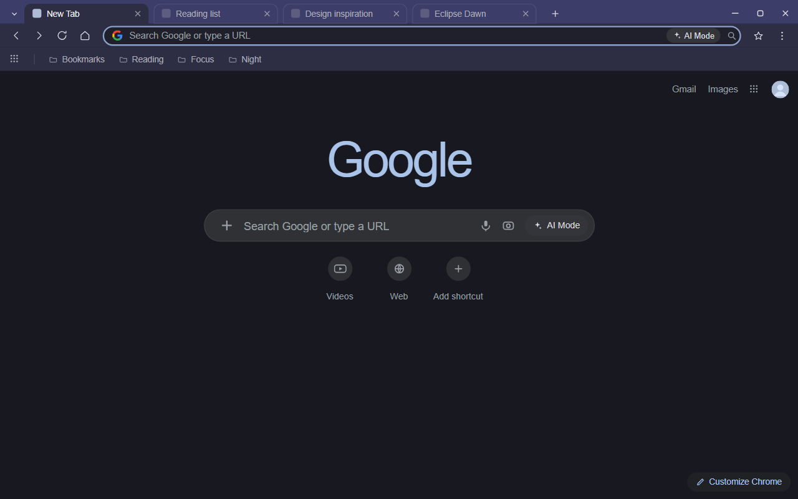
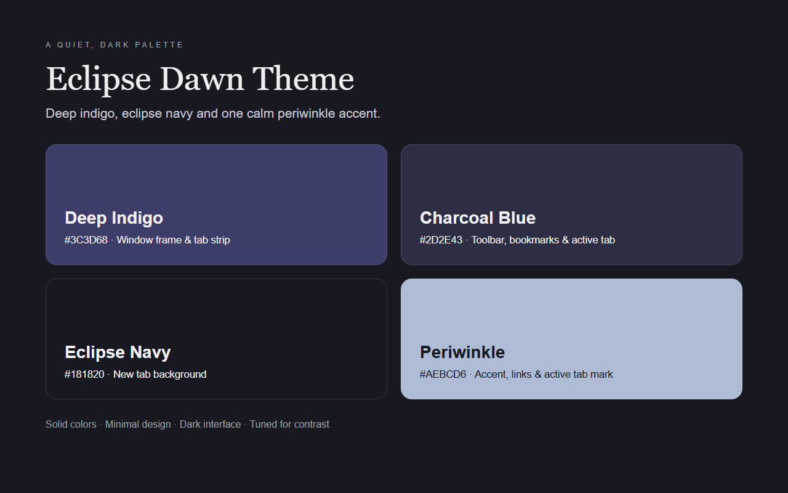

  

<h1 align="center">Eclipse Dawn Theme</h1>

A dark, serene Chrome theme with deep indigo frames, an eclipse-navy new tab, and one calm periwinkle accent.

  
  

## About

Eclipse Dawn Theme quiets the browser down for long stretches of focus. A deep indigo window frame and tab strip sit above a charcoal-blue toolbar, while the new tab page drops to a near-black eclipse navy that lets the work in front of you stand out. A single periwinkle accent carries links, the active tab mark, and the store artwork.

Each layer is a flat, single solid color, and every text tone is tuned so labels stay readable on its own surface. The palette lives entirely in the theme definition, so installing it simply recolors the browser.

## Color Palette

| Token | Hex | Usage |
|-------|-----|-------|
| Deep Indigo | `#3C3D68` | Window frame & tab strip |
| Charcoal Blue | `#2D2E43` | Toolbar, bookmark bar & active tab |
| Eclipse Navy | `#181820` | New tab background |
| Periwinkle | `#AECBD6` | Accent, links & active tab mark |
| Soft White | `#EFEFF1` | New tab & primary text |
| Muted Lilac | `#ACACB9` | Inactive tab, toolbar & bookmark text |

## Chrome UI Notes

Some parts of the browser are painted by Chrome itself, not by the theme manifest. The store screenshots follow what Chrome renders on a dark new-tab page:

- **Google mark on the new-tab page:** with `ntp_logo_alternate` enabled, Chrome paints it in a single light blue tone computed from the new-tab background rather than the four-color brand logo.
- **Shortcut tiles:** the round new-tab shortcut buttons are drawn by the page as a dark grey surface.
- **Window buttons:** Chrome keeps the minimize / maximize / close glyphs light against the indigo frame.
- **Address bar:** the omnibox uses a near-black field so it stays legible inside the charcoal toolbar.

## Features

- Deep indigo, eclipse navy, and periwinkle palette for a calm, dark workspace.
- Solid color design — every surface is a flat, single tone.
- Contrast tuned for readable tab, toolbar, bookmark, and address-bar text.
- Quiet new-tab page that keeps attention on the current task.
- Pure theme built from a color definition alone, with no added code or permissions.

## Install

### From source (unpacked)

1. Download or clone this repository.
2. Open Chrome and navigate to `chrome://extensions`.
3. Enable **Developer mode** in the top-right corner.
4. Click **Load unpacked** and select this folder.

### From Chrome Web Store

Search for **Eclipse Dawn Theme** in the Chrome Web Store and install it.

## Preview

## Files

| File | Description |
|------|-------------|
| `manifest.json` | Chrome theme manifest (MV3) with inline `theme` config |
| `logo/logo128.png` | Chrome Web Store icon (128x128) |
| `store-assets/screenshots/en/` | Store listing screenshots (1280x800) |
| `store-assets/promo/` | Promo tiles (440x280 and 1400x560) |
| `store-assets/store-description.txt` | Store listing detailed description (English) |
| `scripts/generate-references.py` | Renders every store asset from one HTML/CSS source |
| `scripts/generate-logo.py` | Draws the icon concept sheet |
| `scripts/generate-store-assets.py` | Entry point: renders all assets and validates the icon |

## License

Non-Commercial License — personal use permitted. Commercial use requires permission.
